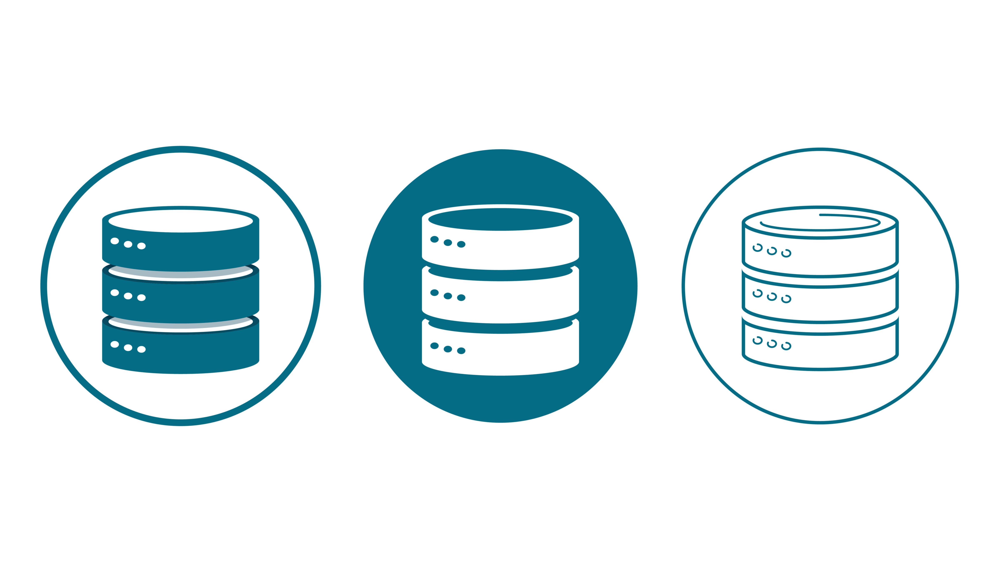
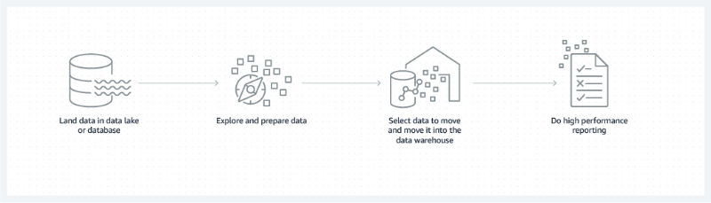

    
    <h1> Web Security Handbook </h1>

This repository was created with the intention diving into a rich collection of insights, best practices, and practical code examples. From fundamental concepts to advanced techniques, this repository equips developers with the tools to build robust, optimized, and secure databases.

# Table Of Contents

- [What is a database?](#what-is-a-database)
- [Why is a database important? ](#why-is-a-database-important)
- [What are the types of databases?](#what-are-the-types-of-databases)
- [What is a database model?](#what-is-a-database-model)
- [How did databases evolve?](#how-did-databases-evolve)
- [What are modern databases?](#what-are-modern-databases)
- [What is a datastore?](#what-is-a-data-store)
- [What are databases used for?](#what-are-databases-used-for)
- [How can AWS Cloud Databases help?](#how-can-aws-cloud-databases-help)

Sources:

- [What is a database?](https://aws.amazon.com/what-is/database/)

# What is a database?

A database is an electronically stored, systematic collection of data. It can contain any type of data, including words, numbers, images, videos, and files. You can use software called a database management system (DBMS) to store, retrieve, and edit data. In computer systems, the word _database_ can also refer to any DBMS, to the database system, or to an application associated with the database.

# Why is a database important?

A high-performing database is crucial to any organization. Databases support the internal operations of companies and store interactions with customers and suppliers. They also hold administrative information and more specialized data, such as engineering or economic models. Examples include digital library systems, travel reservation systems, and inventory systems. The following are some reasons why databases are essential.

**Efficient scaling**

Database applications can manage large amounts of data, scaling to millions, billions, and more. It’s impossible to store this quantity of digital data without a database.

**Data integrity**

Databases often have built-in rules and conditions to maintain data consistency.

**Data security**

Databases support privacy and compliance requirements associated with any data. For example, to gain database access, users must log in. Different users might also have different levels of access, such as read-only.

**Data analytics**

Modern software systems use databases to analyze data. These systems can identify trends and patterns or make predictions. Data analytics help an organization make business decisions with confidence.

# What are the types of databases?

You can classify databases according to their use case, data type, and data storage method. Here are three examples of ways to classify databases:

- By their contents, such as document text, statistics, or multimedia objects
- By their application area, such as accounting, film, or manufacturing
- By their technical aspects, such as the database structure or interface type

# What is a database model?

A database model shows the logical structure of a database. It defines the relationships and rules that determine how data can be stored, organized, and manipulated. Each database application is built on a specific data model. Individual database models are designed based on the rules and concepts of the broader data model that the underlying application adopts.

    

# How did databases evolve?

The earliest databases were magnetic tapes with data records stored sequentially. Databases continued to evolve with advances in technology. They have now become complex, high-performing systems with their own dedicated field of study. Let’s look at how data models evolved.

**Hierarchical database**

Hierarchical databases became popular in the 1970s. Instead of storing data records sequentially, they held them in a _tree structure_, establishing a parent-child relationship between two files. For example, to create a database system for a furniture retail store, you could define _bedroom_ as a parent record with _bed_, _bedside_ _table_, and _wardrobe_ as child records. The _bed_ record could further have more child records such as _single bed_, _double bed_, _queen bed_, and so on. Unfortunately, the hierarchical data model was complex to implement and couldn’t handle multiple parent-child relationships without significant data duplication.

**Network database**

Another early database, the network data model, allowed one child record to have multiple parent records and vice versa. So in the furniture store example, if you had two parent records, _bedroom_ and _kid room_, both could link to the child record _wardrobe_.

**Relational database**

In the 1980s, the relational database emerged as a popular enterprise model due to its productivity, flexibility, and compatibility with faster hardware. Relational databases organized records as several tables instead of linked lists.

In a relational database model, each category has a table, with category attributes as columns and data records as rows. For example, you can model the furniture retail store as a set of tables—_Rooms and Furniture_. The tables are linked by the columns—_Room number_ and _Furniture name_. Both of these columns are also called _primary keys_.

| Room number | Room name |
| ----------- | --------- |
| 1           | Bedroom   |
| 2           | Kids room |

| Furniture name | Color |
| -------------- | ----- |
| Bed            | Brown |
| Wardrobe       | White |
| Bedside table  | Black |

| Room number | Furniture name |
| ----------- | -------------- |
| 1           | Bed            |
| 1           | Wardrobe       |
| 2           | Wardrobe       |

### Object-oriented database

Object-oriented databases evolved in the 1990s in response to the emergence of object-oriented programming. Programmers and designers began to treat the data in their databases as objects. For instance, you can map a chair’s attributes, such as color and size, to a chair data object. This object is a virtual representation of the real-world chair in the object-oriented database.

### NoSQL database

SQL is a query language used to retrieve, access, and edit data in relational databases. NoSQL represents the opposite, a database mechanism that does not use tabular relationships in data modeling. [NoSQL databases](https://aws.amazon.com/nosql/) were created at the start of the twenty-first century when cluster computing and distributed database architectures emerged. Distributed architectures store one large database over multiple underlying storage devices. This arrangement is called horizontal scaling. The software mechanisms used in NoSQL are high speed, no requirement for fixed table schemas, the ability to store duplicated or grouped data, and the ability to scale horizontally.

# What are modern databases?

The databases used today have evolved to scale both vertically and horizontally. They can store vast data in the cloud and provide advanced software interfaces for machine learning and other data analytics.

**Cloud database**

A cloud database typically runs on a cloud-computing platform. There are two standard deployment models: users can run databases on the cloud independently or purchase access from a cloud database provider. Cloud databases can follow both SQL and NoSQL data models.

**Graph database**

[Graph databases](https://aws.amazon.com/nosql/graph/) are useful because they prioritize the relationships between different data records. They are purpose-built to store and navigate relationships. A graph database consists of nodes and edges. Nodes store data objects, and edges store relationships between objects. An edge always has a start node, end node, type, and direction. It can describe parent-child relationships, actions, and ownership. There is no limit to the number and kinds of relationships a node can have.

**In-memory database**

While most databases are stored on external storage devices, an in-memory database resides in a computer’s internal memory. However, it is typically backed up by computer data storage as well. In-memory databases are faster than disk databases. They are often used where response time is critical, such as in telecommunications network equipment.

# What is a datastore?

_Datastore_ is a broad term for the very large data repository of any enterprise. Organizations produce all types of data, including files, documents, videos, customer data, application data, and system data. They use a datastore to process and store all their data, using it for analytics, applications, and data-driven decision making.

[Amazon Redshift](https://aws.amazon.com/redshift/?whats-new-cards.sort-by=item.additionalFields.postDateTime&whats-new-cards.sort-order=desc&-new-cards.sort-order=desc) is a fully managed, petabyte-scale data warehouse service in the cloud. You can start with just a few hundred gigabytes of data and scale to a petabyte or more.

# What are databases used for?

All industries use databases for a variety of use cases. The following are some examples:

**Fraud detection**

Graph databases help with identity management and fraud detection. Machine learning algorithms find patterns and detect fraudulent activity automatically and preemptively.

**Document management**

NoSQL databases store and manage documents, such as articles and contracts. They also allow organizations to query and index documents.

**Gaming and entertainment**

Many gaming and entertainment companies use databases extensively to provide rich media experiences, such as simultaneous login access for millions of users.

# How can AWS Cloud Databases help?

[AWS Cloud Databases](https://aws.amazon.com/products/databases/) provides a broad selection of purpose-built databases for any enterprise. AWS databases support all database management tasks, such as server provisioning, patching, configuration, and backups. As a result, you can focus on application development while AWS continuously monitors your databases and automates scaling. The following are some examples of AWS database services:

- [Amazon Relational Database Service](https://aws.amazon.com/rds/) (Amazon RDS) is a managed service that makes it easy to set up, operate, and scale a [relational database](https://aws.amazon.com/dms/) in the cloud.
- [Amazon Aurora](https://aws.amazon.com/rds/aurora/) is a relational database built for the cloud. As a fully managed service, it automates time-consuming tasks such as provisioning, patching, backup, recovery, failure detection, and repair.
- [Amazon Neptune](https://aws.amazon.com/neptune/) is a graph-oriented database that can execute more than 100,000 queries per second.
- [Amazon Redshift](https://aws.amazon.com/redshift/) is a fully managed, petabyte-scale data warehouse service in the cloud.
- [Amazon ElastiCache](https://aws.amazon.com/elasticache/memcached/) is an in-memory NoSQL database that is fully managed, scalable, and secure. It is a popular choice for mobile apps, gaming, e-commerce, and other applications where frequently accessed data must be stored in memory.
